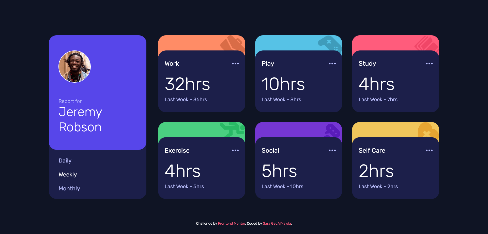

# Frontend Mentor - Time tracking dashboard solution

## Table of contents

- [Overview](#overview)
  - [The challenge](#the-challenge)
  - [Screenshot](#screenshot)
  - [Links](#links)
- [My process](#my-process)
  - [Built with](#built-with)
  - [What I learned](#what-i-learned)
  - [Continued development](#continued-development)
  - [Useful resources](#useful-resources)
- [Author](#author)

## Overview

This is a solution to the [Time tracking dashboard challenge on Frontend Mentor](https://www.frontendmentor.io/challenges/time-tracking-dashboard-UIQ7167Jw). Frontend Mentor challenges help you improve your coding skills by building realistic projects.

### The challenge

Users should be able to:

- View the optimal layout for the site depending on their device's screen size
- See hover states for all interactive elements on the page
- Switch between viewing Daily, Weekly, and Monthly stats

### Screenshot

## My process

- Break down the design into possible sections
- Write down the HTML initial skeleton
- Write the CSS for the Mobile version first
- Tweak the HTML as needed
- Continue to large screens modifications
- Tweak HTML as requiered

### Built with

- Semantic HTML5 markup
- CSS custom properties
- Flexbox
- Mobile-first workflow

### What I learned

- The versatility of FlexBox, I used it a lot in this project.
- The importance of keeping the specificity of CSS selectors in mind especially when debugging.
- I practiced some positioning while trying to get the colored backgrounds in place.
- I discovered Microsoft Power Toys, mainly the color picker there.

### Continued development

- I need to practice better positioning techniques

- Using paddings and margins in responsive design proved difficult, I want to practice
propper use of those propperties while stying responsive

- Practice better mobile first flow as I found myself overwriting a lot of what I coded
for the mobile version.

### Useful resources

- [MDN on FlexBox](https://developer.mozilla.org/en-US/docs/Learn/CSS/CSS_layout/Flexbox) - I looked at this documentation a lot when trying to figure things out.

## Author

- Frontend Mentor - [@SaraGadAlMawla](https://www.frontendmentor.io/profile/SaraGadAlMawla)
- Twitter - [@SaraGadAlMawla](https://twitter.com/SaraGadAlMawla)
